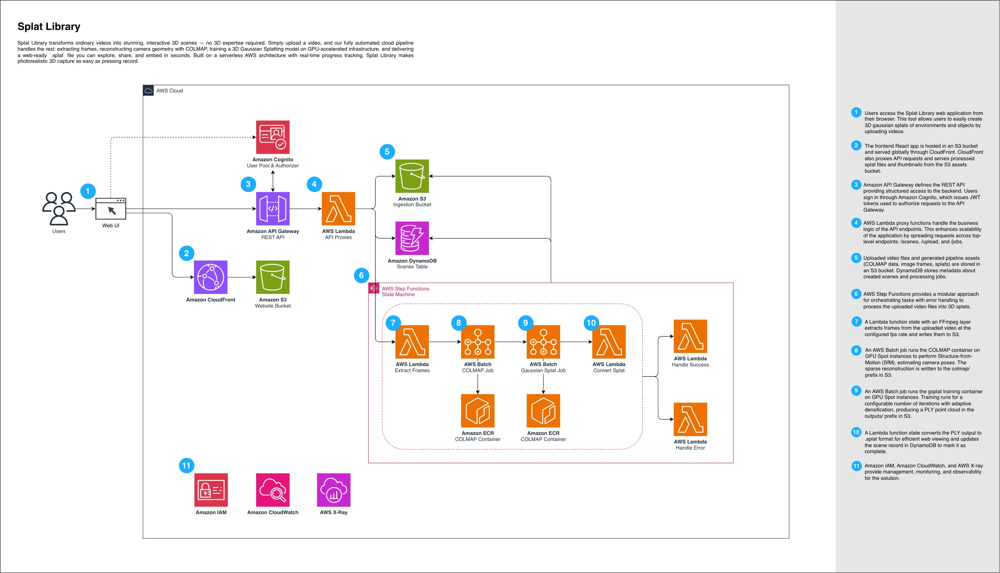

# Splat Library


A scalable 3D Gaussian Splatting creation pipeline and viewer library on AWS.

## Overview

Splat Library transforms ordinary videos into stunning, interactive 3D scenes — no 3D expertise required. Simply upload a video, and our fully automated cloud pipeline handles the rest: extracting frames, reconstructing camera geometry with COLMAP, training a 3D Gaussian Splatting model on GPU-accelerated infrastructure, and delivering a web-ready `.splat` file you can explore, share, and embed in seconds. Built on a serverless AWS architecture with real-time progress tracking, Splat Library makes photorealistic 3D capture as easy as pressing record.

### Features

- **Video Upload** - Upload videos with configurable frame extraction (fps)
- **COLMAP Processing** - Structure-from-Motion camera pose estimation
- **3DGS Training** - GPU-accelerated Gaussian Splatting using [gsplat](https://github.com/nerfstudio-project/gsplat)
- **Advanced Settings** - Configurable iterations, densification parameters
- **Real-time Status** - 6-stage pipeline progress tracking with live updates
- **Web Viewer** - Interactive 3D scene viewing in the browser
- **Scene Gallery** - Browse and share public scenes
- **Scene Management** - Delete scenes with ownership verification
- **Authentication** - Secure user authentication with AWS Cognito

## Architecture



### How It Works

1. **Users** — Users access the Splat Library from their browser to upload videos, track processing progress, and explore completed 3D scenes in an interactive viewer.

2. **Frontend Delivery** — A React single-page app is hosted in S3 and served globally through CloudFront, which also proxies API requests and delivers processed `.splat` files.

3. **API Gateway** — An HTTP API routes requests to the backend. Write operations (create, delete) require Cognito JWT authentication; read operations are public.

4. **Lambda API Handlers** — Three Lambda functions handle the API logic: `scenes` (CRUD), `upload` (S3 presigned URLs for direct video upload), and `jobs` (pipeline status and execution).

5. **Storage** — An S3 bucket stores all assets organized by prefix (`videos/`, `frames/`, `colmap/`, `outputs/`). DynamoDB tracks scene metadata and job status.

6. **Pipeline Orchestration** — Step Functions orchestrates the processing pipeline as a state machine with automatic error handling that routes failures to a dedicated handler.

7. **Extract Frames** — A Lambda function with an FFmpeg layer extracts video frames at the configured fps rate and writes them to S3.

8. **COLMAP** — An AWS Batch job runs COLMAP on CPU instances to perform Structure-from-Motion, estimating camera poses from the extracted frames.

9. **Gaussian Splatting** — An AWS Batch job trains a 3D Gaussian Splatting model on GPU Spot instances using gsplat, producing a PLY point cloud.

10. **Convert Splat** — A Lambda function converts the PLY output to `.splat` format for web viewing and marks the scene as complete in DynamoDB.

11. **Management and Observability** — IAM provides least-privilege access control, CloudWatch collects logs for debugging, and X-Ray enables distributed tracing across the pipeline.

## Tech Stack

| Layer | Technology |
|-------|------------|
| Frontend | React 18, TypeScript, TailwindCSS, Vite |
| Auth | Amazon Cognito |
| API | API Gateway + Lambda (Python 3.13) |
| Pipeline | Step Functions, AWS Batch |
| 3DGS Engine | [gsplat](https://github.com/nerfstudio-project/gsplat) 1.5.3 |
| Containers | NVIDIA PyTorch 24.12, pycolmap, ECR |
| Storage | S3, DynamoDB |
| CDN | CloudFront |
| IaC | Terraform |
| Monorepo | Nx + pnpm |

## Processing Pipeline

The pipeline consists of 6 stages with real-time status updates:

| Stage | Description | Compute |
|-------|-------------|---------|
| **Upload** | Video uploaded to S3 | - |
| **Extract** | Extract frames at configured fps | Lambda |
| **Analyze** | COLMAP Structure-from-Motion | Batch (CPU) |
| **Generate** | gsplat 3DGS training | Batch (GPU) |
| **Convert** | Convert PLY to .splat format | Lambda |
| **Complete** | Scene ready for viewing | - |

### Training Parameters

| Parameter | Default | Description |
|-----------|---------|-------------|
| `fps` | 3 | Frames per second to extract from video |
| `iterations` | 30,000 | Training iterations |
| `densifyUntilIter` | 15,000 | Densification cutoff iteration |
| `densificationInterval` | 100 | Iterations between densification |

## Prerequisites

- Node.js 18+
- pnpm 8+
- Python 3.11+
- Docker
- AWS CLI configured
- Terraform 1.5+

## Getting Started

### 1. Clone and Install

```bash
git clone <repository-url>
cd splat-library
pnpm install
```

### 2. Build

```bash
pnpm build
```

### 3. Deploy Infrastructure

```bash
cd infra
terraform init
terraform plan
terraform apply
```

### 4. Build and Push Containers

```bash
cd containers
AWS_REGION=us-west-2 ./build.sh
```

**Note:** The gaussian-splatting container builds gsplat from source (~10-15 min). CUDA kernels JIT compile on first Batch job run (~2-3 min additional).

### 5. Configure Environment

Create `packages/web/.env.local`:

```env
VITE_API_URL=https://<api-gateway-url>
VITE_CDN_URL=https://<cloudfront-url>
VITE_COGNITO_USER_POOL_ID=<user-pool-id>
VITE_COGNITO_CLIENT_ID=<client-id>
```

### 6. Run Development Server

```bash
pnpm dev
```

## Project Structure

```
splat-library/
├── packages/
│   └── web/                 # React frontend
├── services/
│   └── api/                 # Lambda handlers
│       └── src/handlers/
│           ├── scenes.py    # Scene CRUD operations
│           ├── jobs.py      # Job status endpoints
│           ├── extract_frames.py
│           ├── convert.py
│           └── handle_failure.py
├── containers/
│   ├── colmap/              # COLMAP container (pycolmap)
│   └── gaussian-splatting/  # gsplat training container
│       ├── Dockerfile       # NVIDIA PyTorch 24.12 + gsplat from source
│       └── run.py           # Training script
├── infra/                   # Terraform infrastructure
│   └── modules/
│       ├── cognito/
│       ├── storage/
│       ├── api/
│       └── pipeline/
└── .kiro/
    └── specs/               # Technical specifications
```

## Container Details

### COLMAP Container
- Base: `colmap/colmap:latest`
- Runs Structure-from-Motion to estimate camera poses
- Outputs sparse reconstruction to S3

### Gaussian Splatting Container
- Base: `nvcr.io/nvidia/pytorch:24.12-py3` (PyTorch 2.6 + CUDA 12.6)
- gsplat 1.5.3 built from source for compatibility
- Custom training loop with:
  - COLMAP binary file parsing
  - Scene normalization
  - Spherical harmonics (degree 3)
  - Adaptive densification strategy
  - PLY export in 3DGS format

## API Endpoints

| Method | Path | Auth | Description |
|--------|------|------|-------------|
| POST | /upload | Yes | Get presigned URL for video upload |
| POST | /scenes | Yes | Create scene and start pipeline |
| GET | /scenes | No | List public completed scenes |
| GET | /scenes/{id} | No | Get scene details |
| DELETE | /scenes/{id} | Yes | Delete scene (owner only) |
| GET | /scenes/{id}/status | No | Get processing status |

## Configuration

### AWS Region

Default: `us-west-2`

Configure in `infra/variables.tf`:

```hcl
variable "aws_region" {
  default = "us-west-2"
}
```

### Batch Instance Types

- **CPU (COLMAP)**: c6i.2xlarge, c6i.4xlarge
- **GPU (3DGS)**: g5.xlarge, g6.xlarge

## Cost Estimates

| Component | Estimated Cost |
|-----------|----------------|
| COLMAP processing | ~$0.10-0.30/scene |
| 3DGS training | ~$0.25-0.50/scene |
| Storage | ~$0.02/month/scene |
| **Total per scene** | **~$0.40-0.80** |

*Using Spot instances for Batch compute.*

## Contributing

1. Fork the repository
2. Create a feature branch (`git checkout -b feature/amazing-feature`)
3. Commit your changes (`git commit -m 'Add amazing feature'`)
4. Push to the branch (`git push origin feature/amazing-feature`)
5. Open a Pull Request

## License

This project is licensed under the MIT-0 License - see the [LICENSE](LICENSE) file for details.

## Acknowledgments

- [gsplat](https://github.com/nerfstudio-project/gsplat) - High-performance 3DGS library by nerfstudio
- [COLMAP](https://colmap.github.io/) - Structure-from-Motion pipeline
- [pycolmap](https://github.com/colmap/colmap) - Python bindings for COLMAP
- [3D Gaussian Splatting](https://github.com/graphdeco-inria/gaussian-splatting) - Original 3DGS paper implementation
